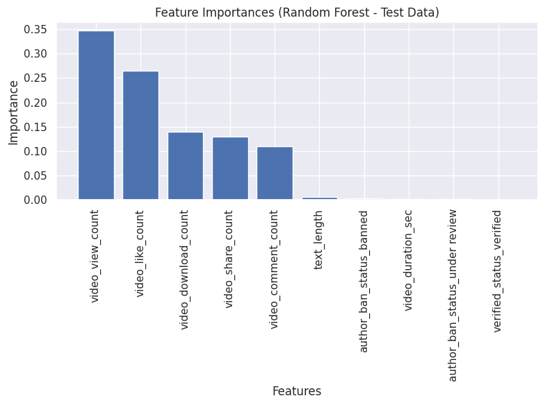

# TikTok Claims vs. Opinions: A Predictive Classification Model

**Project Subtitle:** Using a Random Forest model to classify TikTok video content for efficient content moderation.

---

### 📋 Table of Contents
- [Project Overview](#project-overview)
- [Problem Statement](#problem-statement)
- [Data Source](#data-source)
- [Methodology](#methodology)
- [Key Results](#key-results)
- [Business Recommendations](#business-recommendations)
- [How to Run This Project](#how-to-run-this-project)

---

### 🌐 Project Overview
This project addresses the operational challenge of manually reviewing a large volume of user-reported videos on TikTok. I developed a machine learning model to automatically distinguish between "claims" and "opinions," enabling the content moderation team to prioritize their efforts effectively. The final model proved to be exceptionally accurate and reliable.

---

### 🎯 Problem Statement
TikTok's content moderators face a significant backlog of user-reported videos. Manually reviewing each report to identify videos containing unverified 'claims' is time-consuming and inefficient, leading to delays in addressing potentially harmful content. The goal was to build a predictive model to automate this prioritization process.

---

### 💾 Data Source
The dataset used for this project is `tiktok_dataset.csv`, containing synthetic data representing 19,382 TikTok videos. Each row includes video metadata, transcription text, and key user engagement metrics such as views, likes, shares, and comments.

---

### 🛠️ Methodology
The project followed a structured data science workflow:
1.  **Exploratory Data Analysis (EDA):** Investigated the data to understand its structure, find patterns, and identify outliers.
2.  **Data Preprocessing:** Handled missing values, capped extreme outliers in engagement metrics, and engineered a `text_length` feature.
3.  **Model Development:** Built and trained a **Random Forest Classifier**.
4.  **Hyperparameter Tuning:** Used `GridSearchCV` to find the optimal model parameters, prioritizing the **recall** score to minimize missed claims.
5.  **Model Evaluation:** Assessed the final model's performance on a held-out test set using a confusion matrix, precision, and recall.

---

### ✨ Key Results
The final Random Forest model demonstrated outstanding performance on the unseen test data:

| Metric    | Score  | Interpretation                                             |
| :-------- | :----- | :--------------------------------------------------------- |
| **Recall** | **99.2%** | Successfully identified 99.2% of all "claims".             |
| **Precision** | **100%** | **Zero false positives.** Every video flagged was a real claim. |
| **Accuracy** | **99.6%** | Excellent overall accuracy.                                |

#### Key Insights:
* **Community Engagement is the #1 Predictor:** The model's decisions were most heavily influenced by user engagement metrics (views, likes, shares), not the author's status. This suggests the community's reaction is the most reliable signal for identifying a "claim".
* **Zero Wasted Effort:** With 100% precision, the model ensures that no moderator time is wasted reviewing incorrectly flagged content.

---

### 📈 Business Recommendations
Based on the model's success, I propose the following:
1.  **Deploy the Model:** Immediately integrate the model into the moderation workflow to prioritize the review queue.
2.  **Invest in Model V2 (with NLP):** Charter a follow-up project to analyze the actual text of videos using NLP, aiming to close the remaining 0.8% gap in recall.
3.  **Re-evaluate Manual Rules:** Review internal moderation rules that rely on author status, as the model has shown this to be a weak predictor compared to engagement.
